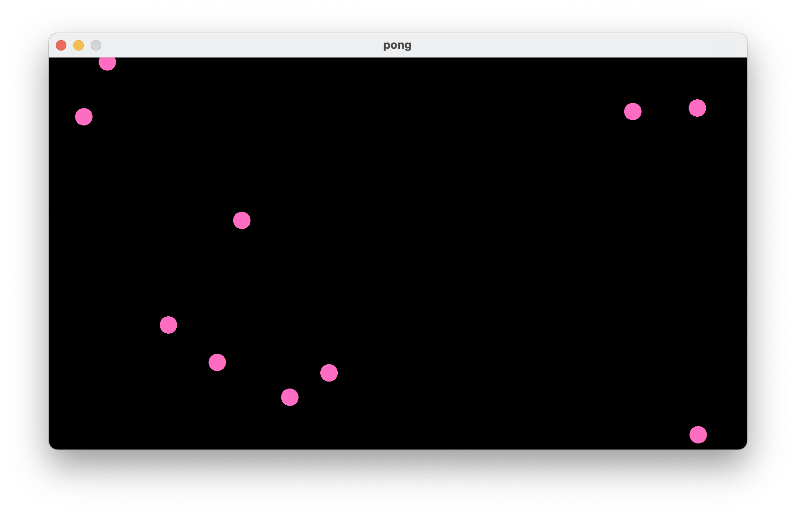

I've been experimenting with using Zig for simple games and graphics lately.
Raylib is a great library for 2D graphics, ut it took me a while to figure out
how to setup with Zig. So I thought I'd write up a quick guide.

This will essentially be re-iterating the information found in in the
[raylib-zig](https://github.com/Not-Nik/raylib-zig) README. But I everytime I've
gone to setup the raylib with Zig I had to re-figure out how to do this. So this
is more of a guide for my future self then it being useful for others 😅.

## Install Zig

Install the latest stable version of Zig by following the instructions on the
[Zig website](https://ziglang.org/download/).

I recommend using something like [zigup](https://github.com/marler8997/zigup) to
install Zig. This makes switching between versions easy.

As of time of writing, Zig 0.13.0 is the latest version.

## Create a new Zig project

Create a new directory for your project and navigate into it.

```sh
mkdir zig-with-raylib
cd zig-with-raylib
```

Initialize a new Zig project.

```sh
zig init
```

## Add Raylib to your project 

We will be using the [raylib-zig](https://github.com/Not-Nik/raylib-zig)
bindings. Fetch the bindings and add them to your project with:

```sh
zig fetch --save https://github.com/Not-Nik/raylib-zig/archive/devel.tar.gz
```

## Configure build.zig

After installing the exe artifact, configure the raylib dependency.

```zig
b.installArtifact(exe); // already exists

const raylib_dep = b.dependency("raylib-zig", .{
    .target = target,
    .optimize = optimize,
});

const raylib = raylib_dep.module("raylib");
const raylib_artifact = raylib_dep.artifact("raylib");

exe.linkLibrary(raylib_artifact);
exe.root_module.addImport("raylib", raylib);
```

## Render something

Now you can just copy the code in the README from
[raylib-zig](https://github.com/Not-Nik/raylib-zig). But here lets get setup
with something a little more structure.

We are going to make a little program where a bunch of balls bounce around the screen.

### Imports and constants

Lets define some imports and constants.

```zig
const std = @import("std");
const rl = @import("raylib");

const num_balls = 10;

const screen_width = 800;
const screen_height = 450;

const frame_rate = 60.0;
const tick_rate = 30.0; // 30 ticks per second
```

### Ball and game state

Lets define a `Ball` and a `GameState`.

The `Ball` struct will hold the position and velocity of a ball. The `GameState`
struct will hold a list of balls and the `init`, `update`, and `draw` methods
for the game state.

I like this pattern for simple games because it keeps things pretty organized.
Each object is in control of its own state and behaviour. The `GameState` object
controls the game loop and the `Ball` objects are responsible for their own
movement and drawing.

```zig
const Ball = struct {
    pos: rl.Vector2,
    vel: rl.Vector2,

    pub fn random_ball(rng: *std.rand.DefaultPrng) Ball {
        return Ball{
            .pos = .{
                .x = rng.random().float(f32) * screen_width,
                .y = rng.random().float(f32) * screen_height,
            },
            .vel = .{
                .x = rng.random().float(f32) * 5 + 5,
                .y = rng.random().float(f32) * 5 + 5,
            },
        };
    }

    pub fn update(self: *Ball) void {
        self.pos.x += self.vel.x;
        self.pos.y += self.vel.y;

        // Bounce off walls
        if (self.pos.x <= 0 or self.pos.x >= screen_width) {
            self.vel.x *= -1;
        }
        if (self.pos.y <= 0 or self.pos.y >= screen_height) {
            self.vel.y *= -1;
        }

        // Ensure the ball stays within the screen bounds
        self.pos.x = std.math.clamp(self.pos.x, 0, screen_width);
        self.pos.y = std.math.clamp(self.pos.y, 0, screen_height);
    }

    pub fn draw(self: Ball) void {
        rl.drawCircle(@intFromFloat(self.pos.x), @intFromFloat(self.pos.y), 10, rl.Color.pink);
    }
};

const GameState = struct {
    balls: []Ball,

    pub fn init(allocator: std.mem.Allocator, rng: *std.rand.DefaultPrng) !GameState {
        var balls = try allocator.alloc(Ball, num_balls);
        errdefer allocator.free(balls);

        var i: usize = 0;
        while (i < num_balls) : (i += 1) {
            balls[i] = Ball.random_ball(rng);
        }

        return GameState{ .balls = balls };
    }

    pub fn update(self: *GameState) void {
        for (self.balls) |*ball| {
            ball.update();
        }
    }

    pub fn draw(self: *GameState) void {
        for (self.balls) |ball| {
            ball.draw();
        }
    }
};
```

### Main

Now we can write our `main` function. This will handle initializing Raylib and
our game state. It will also handle the game loop and exit when the window is
closed.

```zig
pub fn main() anyerror!void {
    var rng = std.rand.DefaultPrng.init(@intCast(std.time.milliTimestamp()));

    rl.initWindow(screen_width, screen_height, "pong");
    defer rl.closeWindow();

    const target_tick_rate = 1.0 / tick_rate;
    var accumulated_time: f32 = 0.0;

    rl.setTargetFPS(frame_rate);

    var gpa = std.heap.GeneralPurposeAllocator(.{}){};
    defer _ = gpa.deinit();
    const allocator = gpa.allocator();

    // Create balls
    var game_state = try GameState.init(allocator, &rng);
    defer game_state.deinit(allocator);
    // Main game loop
    while (!rl.windowShouldClose()) {
        const deltaTime = rl.getFrameTime();
        accumulated_time += deltaTime;

        while (accumulated_time >= target_tick_rate) {
            game_state.update();

            accumulated_time -= target_tick_rate;
        }

        rl.beginDrawing();
        rl.clearBackground(rl.Color.black);

        // Draw the game state
        game_state.draw();

        rl.endDrawing();
    }
}
```

## Run the program

Lets run the program and see what we get.

```sh
zig build run
```

And there we have it! A bunch of pink balls bouncing around the screen.



## Repo

You can find all the code for this post [here](https://github.com/coffee-cup/zig-with-raylib).
